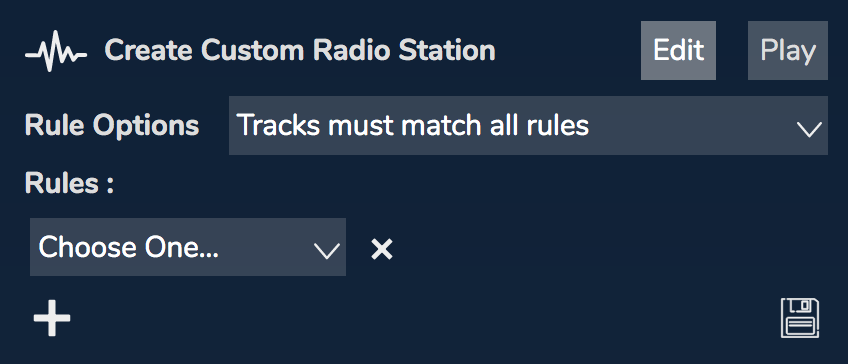
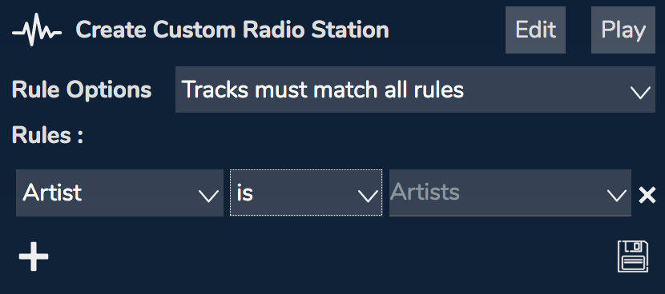
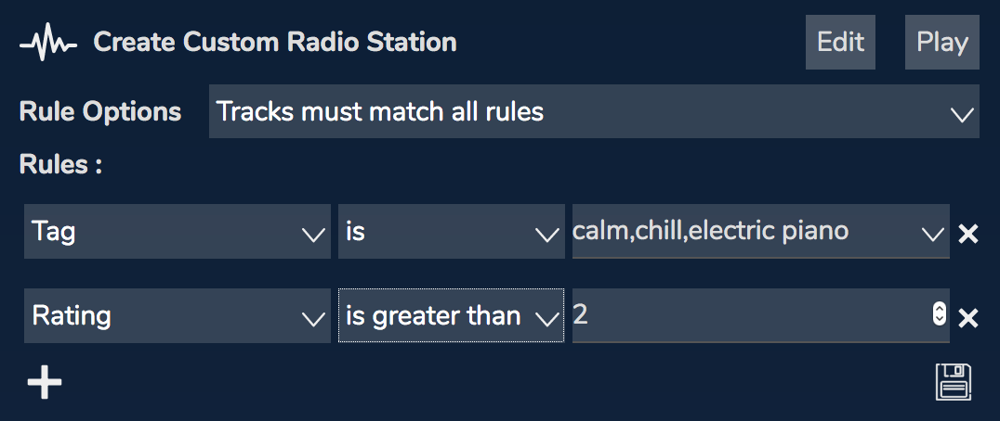
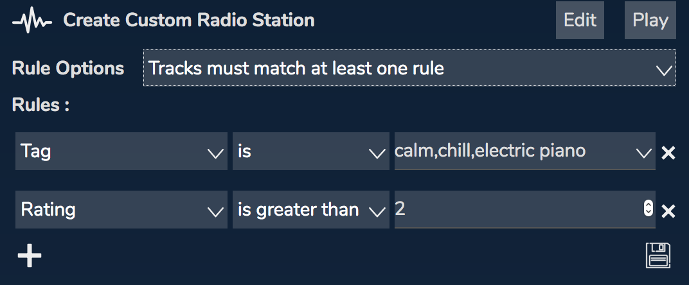
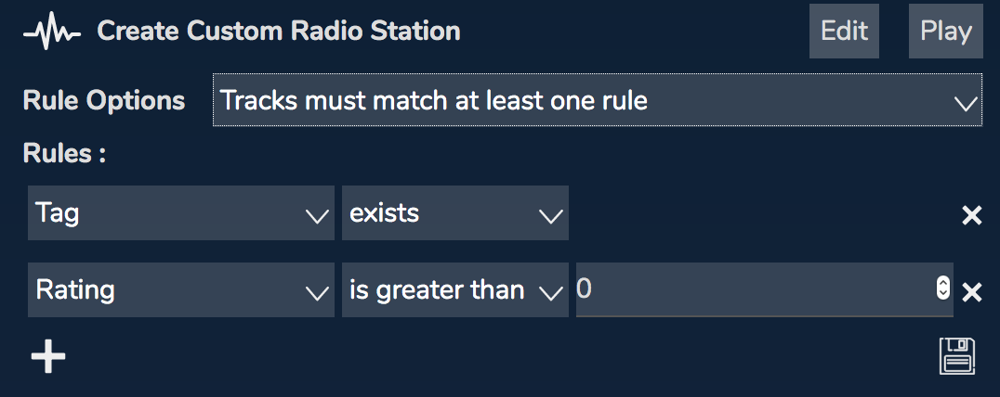
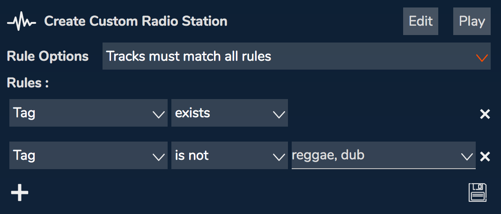

# Personalised Radio

Your listening habits, tags, and ratings, can be used to generate dynamic playlists on-the-fly.

Mopidy users get a host of extra online Music Discovery stations, that are described [here](/RompR/Music-Discovery).

These should all be self-explanatory. You can choose to play by Tag or Rating, or other criteria.

When you start one of these stations playing, 5 tracks will be added to the Play Queue, a header will appear at the top of the Play Queue, and Consume mode will be enabled (and cannot be disabled while the station is playing).

You can skip, pause, stop, etc as normal. When a track has finished it will be removed from the Play Queue and a new one will be added. You can add tracks to the end of the Play Queue (or any other position) and re-order the Play Queue as normal. New tracks will only be added automatically when there are less than 5.

To stop the dynamic playlist generation and return to normal mode, either click the x next to the header or clear the playlist.

## Creating A Custom Radio Station

You can create custom Personal Radio Stations that combine several Rules to choose tracks from your Music Collection. This feature is inspired by Kodi's Party Mode. Start By clicking the Edit button:

### Rules for Rules

You can choose whether the tracks selected must match any of the rules or all of the rules. For even more flexibility you can use multiple values within rules as described below.

### Creating Rules

Rules can be created to select from:

* Artist
* Album Artist
* Track Title
* Album Title
* Genre
* Tag
* Rating
* Playcount
* Duration
* Year
* Track Number
* Disc Number
* Days since last played

To create a rule, choose one of these from the dropdown menu. This will cause further options to appear.

For each rule choose an option from the middle column, and enter some values in the end column.

To add another rule, click on the + icon. To remove a rule, click the x.

To save the settings so you can easily recall them in future, click the Floppy Disc icon. Your saved Radio Station will then appear in the list - it can still be edited afterwards.

### Using Multiple Values in Rules

Rules that use values that are not numbers can accept multiple values in one rule. To understand how this makes the rules even more flexible, it's best to use some examples.

In the example below, the tracks must match both rules. This will choose tracks where the Tag is either 'calm', 'chill', or 'electric piano' and the Rating is greater than 2. Or to express it a different way:

(Tag = calm OR Tag = chill OR tag = electric piano) AND Rating > 2

Now compare this one. The only thing that has changed is that tracks must now match at least one rule. This will choose tracks where the Tag is either 'calm', 'chill', or 'electric piano' or the Rating is greater than 2. Or to express it a different way:

(Tag = calm OR Tag = chill OR tag = electric piano) OR Rating > 2

By using multiple rules with the Options set appropriately it is possible to create Radio Stations with very specific criteria indeed.

When using Tag as a rule there is one extra option - 'exists', which means 'The track has a tag'. This one will choose tracks that have a tag or a rating.

This final example shows how to choose all tracks that have a Tag except the Tags 'reggae' or 'dub'. You need the 'exists' rule in there because 'Tag is not something' also implies 'Tag does not exist'.

## Number of Upcoming Tracks

By default, 5 upcoming tracks will be displayed. You can change this number from the Prefs Panel

## Mobile Devices

When using a mobile device to run RompЯ, you should understand that the browser must be open for new tracks to keep being added. If the device sleeps (screen turns off) then the playlist will stop updating until you wake the device.

One way around this is to run [romonitor](/RompR/Rompr-And-Mobiles), which is capable of repopulating some of the Personalised Radio stations by itself.
